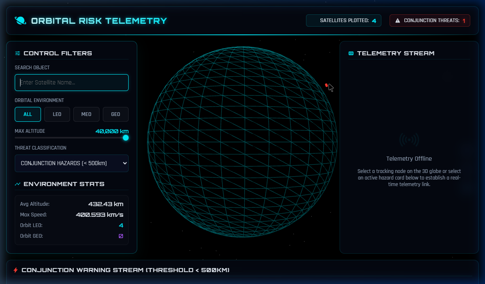

<p align="center">
  
</p>

<h1 align="center">🛰️ SpaceRisk Radar</h1>
<h3 align="center">AI-Powered Orbital Collision Prediction & Space Debris Monitoring Platform</h3>

<p align="center">
  
  
  
  
  
</p>

<p align="center">
  A real-time space situational awareness platform that propagates satellite orbits using SGP4/SDP4 algorithms, detects conjunction threats, simulates Kessler syndrome cascading debris risks, and visualizes the entire orbital environment on an interactive 3D globe.
</p>

---

## 📋 Table of Contents

- [Project Overview](#-project-overview)
- [Problem Statement](#-problem-statement)
- [Key Features](#-key-features)
- [System Architecture](#-system-architecture)
- [Technology Stack](#-technology-stack)
- [Project Structure](#-project-structure)
- [Installation Guide](#-installation-guide)
- [Running the Application](#-running-the-application)
- [API Endpoints](#-api-endpoints)
- [Data Sources](#-data-sources)
- [Orbital Collision Prediction Module](#-orbital-collision-prediction-module)
- [Kessler Syndrome Risk Analysis](#-kessler-syndrome-risk-analysis)
- [Ground Station Visibility Analysis](#-ground-station-visibility-analysis)
- [Orbital Heatmap Visualization](#-orbital-heatmap-visualization)
- [Upcoming Launch Tracking](#-upcoming-launch-tracking)
- [Screenshots](#-screenshots)
- [Future Enhancements](#-future-enhancements)
- [Research & Scientific Background](#-research--scientific-background)
- [Performance & Scalability](#-performance--scalability)
- [Contributing Guidelines](#-contributing-guidelines)
- [License](#-license)
- [Author](#-author)

---

## 🌍 Project Overview

**SpaceRisk Radar** is a comprehensive space situational awareness (SSA) platform designed to monitor, predict, and visualize orbital collision risks in real time. The platform ingests live Two-Line Element (TLE) data from CelesTrak, propagates satellite positions using the SGP4/SDP4 orbital mechanics model, and performs proximity screening to identify potential conjunction events between space objects.

The system features a cinematic **3D globe visualization** built with Three.js that renders satellite positions, orbital trajectories, conjunction threat lines, ground station visibility cones, orbital congestion heatmaps, and Kessler syndrome debris cloud simulations — all updated in real time via WebSocket connections.

---

## 🎯 Problem Statement

With over **10,000+ active satellites** and **36,000+ tracked debris objects** orbiting Earth, the risk of orbital collisions has never been higher. The 2009 Iridium-Cosmos collision and the 2021 Russian ASAT test demonstrated how a single event can generate thousands of debris fragments, threatening the long-term sustainability of space operations.

**SpaceRisk Radar** addresses these challenges by providing:

- **Real-time conjunction screening** for collision avoidance decision-making
- **Kessler syndrome simulation** to assess cascading debris risks
- **Accessible visualization** that makes orbital mechanics data understandable
- **Open-source tooling** for researchers, educators, and space enthusiasts

---

## ✨ Key Features

| Feature | Description |
|---|---|
| 🌐 **3D Globe Visualization** | Interactive Three.js globe rendering 2000+ satellites in real time with orbital trajectories |
| ⚠️ **Conjunction Detection** | Automated proximity screening with configurable threshold (10–2000 km) |
| 🔴 **Multi-Tier Risk Assessment** | CRITICAL / HIGH / MEDIUM / LOW threat classification with collision probability |
| 💥 **Kessler Syndrome Simulation** | Monte Carlo debris cascade modeling with chain-reaction probability analysis |
| 📡 **Ground Station Visibility** | Line-of-sight analysis for 12 global ground stations with elevation masking |
| 🗺️ **Orbital Heatmap** | Congestion density visualization binned by lat/lon grid cells |
| 🚀 **Launch Tracking** | Upcoming launch schedule from Launch Library 2 API with countdown timers |
| 🔄 **Real-Time Updates** | Socket.IO WebSocket push every 3 seconds for live telemetry |
| 🔍 **Satellite Search** | Fuzzy search across the full TLE catalog with auto-complete results |
| ⭐ **Favorites & Watchlist** | Bookmark satellites for quick access with persistent local storage |
| 🔐 **User Authentication** | JWT-based auth with SQLite user profiles, preferences, and alert settings |
| 📊 **Maneuver Predictions** | Drag-based orbit decay and station-keeping maneuver forecasting |
| ⏱️ **Historical Playback** | Time-slider to propagate orbits at any past/future epoch |
| 📱 **Responsive Design** | Glassmorphism HUD interface optimized for desktop and tablet |

---

## 🏗️ System Architecture

```
┌─────────────────────────────────────────────────────────────────┐
│                        CLIENT (Browser)                         │
│  ┌──────────┐  ┌──────────┐  ┌──────────┐  ┌──────────────┐   │
│  │ Three.js │  │  HUD UI  │  │ Socket.IO│  │  REST Client │   │
│  │  Globe   │  │  Panels  │  │  Client  │  │  (Fetch API) │   │
│  └────┬─────┘  └────┬─────┘  └────┬─────┘  └──────┬───────┘   │
│       └──────────────┴────────────┬┴───────────────┘           │
└───────────────────────────────────┼─────────────────────────────┘
                                    │ HTTP / WebSocket
┌───────────────────────────────────┼─────────────────────────────┐
│                     BACKEND (Flask + SocketIO)                   │
│  ┌────────────────┐  ┌─────────────────┐  ┌──────────────────┐ │
│  │  TLE Fetcher   │  │ Orbit Calculator│  │   Risk Engine    │ │
│  │  (CelesTrak)   │  │  (SGP4/SDP4)    │  │  (Conjunction)   │ │
│  └───────┬────────┘  └───────┬─────────┘  └────────┬─────────┘ │
│          │                   │                      │           │
│  ┌───────┴───────┐  ┌───────┴─────────┐  ┌────────┴─────────┐ │
│  │ Ground Station│  │ Kessler Cascade │  │  Heatmap Engine  │ │
│  │  Visibility   │  │   Simulator     │  │  (Density Grid)  │ │
│  └───────────────┘  └─────────────────┘  └──────────────────┘ │
│  ┌───────────────┐  ┌─────────────────┐  ┌──────────────────┐ │
│  │ Launch Tracker│  │Maneuver Predict │  │  Auth Service    │ │
│  │ (LL2 API)     │  │ (Drag Decay)    │  │  (JWT + SQLite)  │ │
│  └───────────────┘  └─────────────────┘  └──────────────────┘ │
│  ┌───────────────┐  ┌─────────────────┐  ┌──────────────────┐ │
│  │  Alert System │  │  Cache Layer    │  │  API v1 Router   │ │
│  │  (Dispatcher) │  │  (In-Memory)    │  │  (Blueprint)     │ │
│  └───────────────┘  └─────────────────┘  └──────────────────┘ │
└─────────────────────────────────────────────────────────────────┘
```

---

## 🛠️ Technology Stack

### Backend
| Technology | Purpose |
|---|---|
| **Python 3.10+** | Core backend language |
| **Flask 2.2+** | Lightweight REST API framework |
| **Flask-SocketIO** | Real-time WebSocket push for live telemetry |
| **SGP4** | Satellite orbit propagation (NORAD TLE standard) |
| **Flask-CORS** | Cross-origin resource sharing for frontend integration |
| **PyJWT** | JSON Web Token authentication |
| **SQLite** | Lightweight embedded database for user data |
| **Werkzeug** | Password hashing and WSGI utilities |

### Frontend
| Technology | Purpose |
|---|---|
| **HTML5 / CSS3 / JavaScript** | Core web technologies |
| **Three.js** | 3D WebGL globe rendering |
| **Socket.IO Client** | Real-time data streaming |
| **Ionicons** | Icon library for HUD interface |
| **Google Fonts** | Orbitron + Rajdhani typography |

### External Data Sources
| Source | Data |
|---|---|
| **CelesTrak** | Two-Line Element (TLE) satellite catalog |
| **Launch Library 2** | Upcoming launch schedule data |

---

## 📁 Project Structure

```
SpaceRisk-Radar/
├── backend/
│   ├── app.py                  # Main Flask application & Socket.IO server
│   ├── tle_fetcher.py          # TLE data fetcher from CelesTrak with caching
│   ├── orbit_calculator.py     # SGP4/SDP4 orbit propagation engine
│   ├── risk_engine.py          # Conjunction screening & collision probability
│   ├── ground_station.py       # Ground station visibility analysis
│   ├── heatmap.py              # Orbital congestion heatmap computation
│   ├── kessler.py              # Kessler syndrome cascade simulation
│   ├── launches.py             # Upcoming launch data from Launch Library 2
│   ├── maneuvers.py            # Maneuver prediction & orbit decay modeling
│   ├── alerts.py               # Alert dispatcher & scheduling system
│   ├── auth_service.py         # JWT authentication & user management
│   ├── api_v1.py               # Versioned API v1 blueprint router
│   ├── cache_layer.py          # In-memory caching layer with TTL
│   └── openapi_spec.py         # OpenAPI 3.0 specification generator
│
├── frontend/
│   ├── index.html              # Main HUD dashboard (glassmorphism UI)
│   ├── globe.js                # Three.js 3D globe renderer
│   ├── ui.js                   # UI logic, filters, search, and telemetry
│   ├── earth_cyber_texture.png # Custom globe texture
│   ├── screenshot.png          # Application screenshot
│   └── vendor/
│       ├── socket.io.min.js    # Socket.IO client library
│       ├── socket.io.local.js  # Socket.IO local fallback
│       └── ionicons.local.js   # Ionicons local fallback
│
├── tools/
│   ├── check_frontend.py       # Frontend health-check utility
│   ├── check_objects.py        # Object propagation verification
│   ├── inspect_app.py          # App inspection utility
│   ├── run_search_nisar_local.py # Search integration test
│   ├── search_nisar.py         # NISAR satellite search test
│   └── test_search_urls.py     # URL search endpoint tests
│
├── requirements.txt            # Python dependencies
├── .gitignore                  # Git ignore rules
└── README.md                   # This file
```

---

## 🚀 Installation Guide

### Prerequisites

- **Python 3.10+** — [Download Python](https://www.python.org/downloads/)
- **pip** — Python package manager (included with Python)
- **Git** — [Download Git](https://git-scm.com/downloads)
- **Modern web browser** — Chrome, Firefox, or Edge recommended

### Backend Setup

```bash
# 1. Clone the repository
git clone https://github.com/Bhagyaabbigeri/SpaceRisk-Radar.git
cd SpaceRisk-Radar

# 2. Create a virtual environment
python -m venv .venv

# 3. Activate the virtual environment
# Windows:
.venv\Scripts\activate
# macOS/Linux:
source .venv/bin/activate

# 4. Install Python dependencies
pip install -r requirements.txt
```

### Frontend Setup

The frontend is a static HTML/CSS/JS application — **no build step required**.

The Three.js library is loaded from a CDN in `index.html`. Socket.IO and Ionicons have local vendor fallbacks included.

---

## ▶️ Running the Application

### Step 1: Start the Backend Server

```bash
# From the project root directory
python backend/app.py
```

The backend API server starts on **`http://localhost:5000`** with:
- REST API endpoints for satellite data, conjunctions, and stats
- Socket.IO WebSocket server for real-time push updates
- Background threads for TLE refresh (every 10 minutes) and live object emission (every 3 seconds)

### Step 2: Start the Frontend Server

```bash
# From the frontend directory
cd frontend
python -m http.server 8000
```

### Step 3: Open the Dashboard

Navigate to **`http://localhost:8000`** in your browser.

> **Note:** The backend must be running on port 5000 for live data. The frontend automatically connects to `http://localhost:5000` for API calls and WebSocket streams.

---

## 📡 API Endpoints

### Core Endpoints

| Method | Endpoint | Description |
|---|---|---|
| `GET` | `/api/objects` | Propagated satellite positions (lat, lon, alt, speed) |
| `GET` | `/api/objects?at=<ISO-8601>` | Historical/future orbit propagation at specific time |
| `GET` | `/api/satellite?name=<name>` | Detailed telemetry for a single satellite |
| `GET` | `/api/search?q=<query>` | Fuzzy search across the TLE catalog (max 10 results) |
| `GET` | `/api/conjunctions` | Active conjunction threat list with risk levels |
| `GET` | `/api/conjunctions?threshold=<km>` | Custom proximity threshold (default: 500 km) |
| `GET` | `/api/stats` | Global orbital environment statistics |

### Advanced Analysis Endpoints

| Method | Endpoint | Description |
|---|---|---|
| `GET` | `/api/ground-visibility` | Ground station line-of-sight visibility data |
| `GET` | `/api/heatmap` | Orbital congestion density grid |
| `GET` | `/api/debris-risk` | Kessler syndrome cascade simulation results |
| `GET` | `/api/maneuvers` | Maneuver prediction and orbit decay forecasts |
| `GET` | `/api/launches` | Upcoming launch schedule (from Launch Library 2) |

### Authentication Endpoints

| Method | Endpoint | Description |
|---|---|---|
| `POST` | `/api/auth/register` | Create new user account |
| `POST` | `/api/auth/login` | Authenticate and receive JWT token |
| `GET` | `/api/auth/profile` | Get current user profile (requires auth) |
| `PUT` | `/api/auth/preferences` | Update user preferences and watchlist |

### WebSocket Events

| Event | Direction | Description |
|---|---|---|
| `objects` | Server → Client | Live satellite positions (every 3s) |
| `conjunctions` | Server → Client | Real-time conjunction alerts |
| `stats` | Server → Client | Environment statistics updates |
| `ground_visibility` | Server → Client | Ground station visibility data |
| `heatmap` | Server → Client | Orbital congestion heatmap |
| `debris_risk` | Server → Client | Kessler cascade risk updates |
| `maneuvers` | Server → Client | Maneuver predictions |
| `set_threshold` | Client → Server | Update conjunction screening distance |

---

## 📊 Data Sources

### Two-Line Element Sets (TLE)

SpaceRisk Radar fetches satellite orbital elements from **[CelesTrak](https://celestrak.org/)**, maintained by Dr. T.S. Kelso. TLE data includes:

- **Active satellite catalog** (~10,000+ objects)
- Keplerian orbital elements: inclination, RAAN, eccentricity, argument of perigee, mean anomaly, mean motion
- NORAD catalog numbers for cross-referencing with Space-Track.org
- Element epoch for propagation accuracy assessment

The backend implements a **2-hour local file cache** (`tle_cache.txt`) to prevent CelesTrak rate-limiting (403 bans), with background thread refresh every 10 minutes.

### Launch Data

Upcoming launch information is sourced from the **[Launch Library 2 API](https://thespacedevs.com/)** with a local JSON fallback cache (`launch_cache.json`) for offline resilience.

---

## ⚠️ Orbital Collision Prediction Module

The conjunction screening engine (`risk_engine.py`) implements a multi-stage collision assessment pipeline:

### Stage 1: Proximity Screening
- Computes pairwise distances between all propagated satellite positions
- Filters pairs within the configurable screening threshold (default: 500 km)
- Uses geodetic distance approximation for computational efficiency

### Stage 2: Risk Classification
| Level | Distance | Color | Description |
|---|---|---|---|
| **CRITICAL** | < 10 km | 🔴 Red | Immediate collision risk — maneuver required |
| **HIGH** | 10–50 km | 🟠 Orange | Elevated risk — close monitoring recommended |
| **MEDIUM** | 50–200 km | 🟡 Yellow | Moderate proximity — routine tracking |
| **LOW** | 200+ km | 🔵 Blue | Standard conjunction — logged for awareness |

### Stage 3: Collision Probability
- Probability estimation using relative velocity, miss distance, and combined covariance
- Risk factor analysis including: closing speed, altitude band congestion, object size uncertainty
- Evasion maneuver recommendation generation

---

## 💥 Kessler Syndrome Risk Analysis

The Kessler module (`kessler.py`) simulates the cascading debris generation scenario first described by NASA scientist Donald J. Kessler in 1978:

- **Monte Carlo simulation** of debris cloud generation from each conjunction event
- **Fragment count estimation** based on collision energy and object mass models
- **Chain-reaction probability** calculation for secondary collisions with nearby objects
- **Debris cloud visualization** with propagated spread patterns on the 3D globe
- **Cumulative risk scoring** across all active conjunction threats

The simulation considers:
- Relative closing velocity of conjunction pairs
- Orbital altitude (higher orbits = longer debris lifetime)
- Object density in the collision altitude band
- Fragment dispersion cone modeling

---

## 📡 Ground Station Visibility Analysis

The ground station module (`ground_station.py`) computes real-time line-of-sight visibility between satellites and a network of 12 global tracking stations:

**Included Ground Stations:**
- Cape Canaveral (USA), Vandenberg SFB (USA), Wallops Island (USA)
- Baikonur (Kazakhstan), Plesetsk (Russia)
- Kourou (French Guiana), ESOC Darmstadt (Germany)
- Tanegashima (Japan), Sriharikota (India)
- Wenchang (China), Mahia Peninsula (New Zealand)
- Perth (Australia)

**Analysis Features:**
- Elevation angle masking (minimum 5° above horizon)
- Sub-satellite point distance calculation
- Visibility cone rendering on the 3D globe
- Station-to-satellite link quality estimation

---

## 🗺️ Orbital Heatmap Visualization

The heatmap engine (`heatmap.py`) generates an orbital congestion density map:

- **Grid-based binning** of satellite positions across latitude/longitude cells
- **Altitude band segmentation** (LEO / MEO / GEO / HEO)
- **Density normalization** with configurable color gradient mapping
- **Real-time updates** as satellite positions are re-propagated
- Identification of **high-congestion orbital shells** (e.g., 800 km Sun-synchronous band)

---

## 🚀 Upcoming Launch Tracking

The launch tracker (`launches.py`) provides visibility into the near-term launch manifest:

- **Live data** from Launch Library 2 API (thespacedevs.com)
- **Launch countdown timers** displayed on the HUD interface
- **Launch provider and vehicle identification** (SpaceX, Roscosmos, ISRO, etc.)
- **Pad location mapping** with geographic coordinates
- **Offline fallback** using cached launch data for resilience

---

## 📸 Screenshots

<p align="center">
  
</p>

### 🛰️ Interactive Gallery

| | |
|:---:|:---:|
| <br><b>Global Orbital Network</b> | <br><b>Real-time Telemetry HUD</b> |
| <br><b>Polar Coverage Analysis</b> | <br><b>Conjunction Threat Detection</b> |
| <br><b>Account & Control Panel</b> | <br><b>Deep Space Monitoring</b> |
| <br><b>Mission Replay Timeline</b> | |

<p align="center"><em>SpaceRisk Radar dashboard showing real-time satellite tracking, conjunction threat detection, and orbital telemetry HUD panels</em></p>

---

## 🔮 Future Enhancements

- [ ] **Machine Learning Conjunction Prediction** — LSTM-based time-series forecasting for miss distance trends
- [ ] **Space-Track.org Integration** — Official USSPACECOM conjunction data messages (CDM)
- [ ] **Starlink Constellation Tracker** — Dedicated mega-constellation monitoring module
- [ ] **Orbital Debris Remediation Scoring** — Active debris removal (ADR) priority ranking
- [ ] **Multi-User Collaboration** — Shared watchlists and team alert channels
- [ ] **Mobile PWA** — Progressive web app for mobile field deployment
- [ ] **Docker Containerization** — One-command deployment with Docker Compose
- [ ] **PostgreSQL Migration** — Production-grade database for user management
- [ ] **Email/SMS Alert Integration** — Automated conjunction alert notifications
- [ ] **TLE Accuracy Decay Monitoring** — Epoch freshness tracking and prediction confidence scoring

---

## 📚 Research & Scientific Background

SpaceRisk Radar builds on established methodologies from orbital mechanics and space surveillance:

### Orbital Propagation — SGP4/SDP4
The Simplified General Perturbations (SGP4) model, developed by the NORAD/USSPACECOM, propagates satellite positions from Two-Line Element sets. The implementation accounts for:
- Earth's oblateness (J2, J3, J4 zonal harmonics)
- Atmospheric drag effects (for LEO objects)
- Solar and lunar gravitational perturbations (SDP4 for deep-space objects)
- Secular and periodic variations in orbital elements

**Reference:** Vallado, D.A., Crawford, P., Hujsak, R., Kelso, T.S. (2006). *Revisiting Spacetrack Report #3*. AIAA/AAS Astrodynamics Specialist Conference.

### Conjunction Assessment
The proximity screening methodology follows operational practices from:
- **NASA Conjunction Assessment (CA)** program
- **ESA Space Debris Office** collision avoidance protocols
- **JSpOC (now CSpOC)** screening volume definitions

### Kessler Syndrome
The cascading collision model is inspired by:
- Kessler, D.J., Cour-Palais, B.G. (1978). *Collision frequency of artificial satellites: The creation of a debris belt*. Journal of Geophysical Research, 83(A6), 2637-2646.
- Liou, J.-C., Johnson, N.L. (2006). *Risks in Space from Orbiting Debris*. Science, 311(5759), 340-341.

---

## ⚡ Performance & Scalability

| Metric | Value |
|---|---|
| **Catalog Size** | Up to 2,000 simultaneously propagated objects |
| **Update Frequency** | 3-second Socket.IO push cycle |
| **TLE Refresh** | Every 10 minutes (2-hour file cache for rate limiting) |
| **API Response Time** | < 500ms for cached endpoints |
| **Cache TTL** | 10–60 seconds (endpoint-dependent) |
| **WebSocket Protocol** | Socket.IO with threading async mode |
| **Browser Target** | Chrome 90+, Firefox 88+, Edge 90+ |
| **Propagation Engine** | SGP4 via `python-sgp4` (compiled C extensions) |

### Optimization Strategies
- **In-memory caching** with TTL-based expiration (`cache_layer.py`)
- **Background worker threads** for TLE refresh and Socket.IO emission
- **Propagation limit** (configurable, default 2000 objects) to bound CPU usage
- **Client-side filtering** to reduce data transfer over WebSocket
- **Lazy-loaded advanced overlays** (heatmap, debris risk computed on-demand)

---

## 🤝 Contributing Guidelines

Contributions are welcome! Please follow these steps:

1. **Fork** the repository
2. **Create** a feature branch:
   ```bash
   git checkout -b feature/your-feature-name
   ```
3. **Commit** your changes with meaningful messages:
   ```bash
   git commit -m "feat: add new orbital decay visualization"
   ```
4. **Push** to your fork:
   ```bash
   git push origin feature/your-feature-name
   ```
5. **Open** a Pull Request against `main`

### Commit Message Convention
- `feat:` — New feature
- `fix:` — Bug fix
- `docs:` — Documentation changes
- `refactor:` — Code restructuring
- `test:` — Test additions/modifications
- `chore:` — Build process or auxiliary tool changes

---

## 📄 License

This project is licensed under the **MIT License** — see the [LICENSE](LICENSE) file for details.

```
MIT License

Copyright (c) 2025 Bhagyaabbigeri

Permission is hereby granted, free of charge, to any person obtaining a copy
of this software and associated documentation files (the "Software"), to deal
in the Software without restriction, including without limitation the rights
to use, copy, modify, merge, publish, distribute, sublicense, and/or sell
copies of the Software, and to permit persons to whom the Software is
furnished to do so, subject to the following conditions:

The above copyright notice and this permission notice shall be included in all
copies or substantial portions of the Software.

THE SOFTWARE IS PROVIDED "AS IS", WITHOUT WARRANTY OF ANY KIND, EXPRESS OR
IMPLIED, INCLUDING BUT NOT LIMITED TO THE WARRANTIES OF MERCHANTABILITY,
FITNESS FOR A PARTICULAR PURPOSE AND NONINFRINGEMENT. IN NO EVENT SHALL THE
AUTHORS OR COPYRIGHT HOLDERS BE LIABLE FOR ANY CLAIM, DAMAGES OR OTHER
LIABILITY, WHETHER IN AN ACTION OF CONTRACT, TORT OR OTHERWISE, ARISING FROM,
OUT OF OR IN CONNECTION WITH THE SOFTWARE OR THE USE OR OTHER DEALINGS IN THE
SOFTWARE.
```

---

## 👤 Author

**Bhagyashree Reddy**

- GitHub: [@Bhagyaabbigeri](https://github.com/Bhagyaabbigeri)
- Project: [SpaceRisk-Radar](https://github.com/Bhagyaabbigeri/SpaceRisk-Radar)

---

<p align="center">
  <strong>🛰️ Protecting the orbital commons — one conjunction at a time.</strong>
</p>
